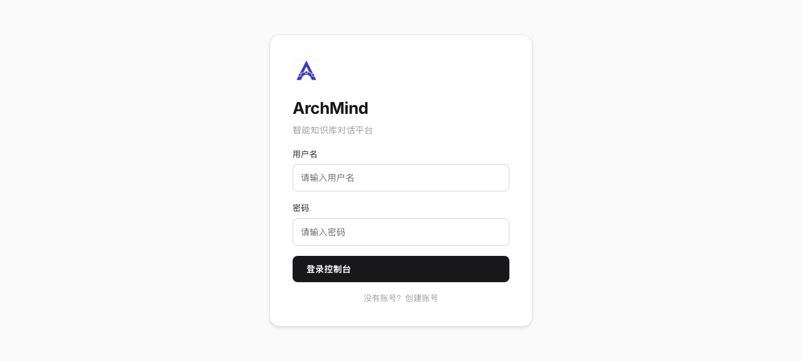

# ArchMind

ArchMind 是一个面向个人知识库场景的智能助手系统。项目由 FastAPI 后端和 React 前端组成，支持用户登录、文件上传、文档入库、RAG 问答、长期记忆、报告生成、模型配置和 Tavily Web 搜索兜底。

## 功能特性

- 用户认证：支持注册、登录和 JWT 访问控制。
- 会话问答：支持多会话管理、流式回答和工具调用过程展示。
- 文件知识库：支持上传 `.txt`、`.md`、`.pdf`、`.csv`、`.docx`、`.pptx` 文件。
- 文档入库：基于 Chroma 向量库和 SQLite 关键词索引进行混合检索。
- RAG 引用：回答可展示引用来源，并支持查看原文片段。
- Web 搜索兜底：知识库没有相关内容时，可通过 Tavily 检索公开网络信息，并结合前三条搜索结果生成回答。
- 长期记忆：支持维护用户偏好、关注点、画像和约束信息。
- 报告生成：支持基于知识库内容生成和管理报告。
- 模型设置：支持在页面中调整聊天模型、Embedding 模型和 RAG 参数。

## 技术栈

### 后端

- Python 3.13+
- FastAPI
- SQLAlchemy + SQLite
- LangChain / LangGraph
- ChromaDB
- DashScope / DeepSeek / OpenAI / Ollama 模型接入
- Tavily Python SDK
- pytest

### 前端

- React
- TypeScript
- Vite
- CSS Modules 风格的全局样式

## 目录结构

```text
.
├── app/                    # FastAPI 后端应用
│   ├── agent/              # Agent、工具和工作流
│   ├── api/                # API 路由
│   ├── config/             # YAML 配置
│   ├── db/                 # 数据库模型和连接
│   ├── prompts/            # 系统提示词和报告提示词
│   ├── rag/                # 文件解析、切片和向量检索
│   ├── schemas/            # Pydantic 模型
│   ├── services/           # 业务服务层
│   └── utils/              # 配置、日志和路径工具
├── frontend/               # React 前端
├── tests/                  # 自动化测试
├── pyproject.toml          # Python 项目依赖
└── uv.lock                 # uv 锁文件
```

## 环境变量

先复制示例配置：

```bash
cp .env.example .env
```

然后按需填写以下变量：

```env
DASHSCOPE_API_KEY=your-dashscope-api-key
DASHSCOPE_BASE_URL=https://dashscope.aliyuncs.com/compatible-mode/v1

DEEPSEEK_API_KEY=your-deepseek-api-key
DEEPSEEK_BASE_URL=https://api.deepseek.com

TAVILY_API_KEY=your-tavily-api-key

JWT_SECRET_KEY=change-me-to-a-long-random-secret
```

说明：

- 默认聊天和 Embedding 配置在 `app/config/model.yaml` 中。
- Tavily 只在需要 Web 搜索兜底时使用；未配置 `TAVILY_API_KEY` 时，系统会提示网络搜索未配置。
- `.env` 包含敏感信息，不应提交到仓库。

## 安装依赖

项目使用 `uv` 管理 Python 依赖：

```bash
uv sync
```

安装前端依赖：

```bash
cd frontend
npm install
```

## 启动项目

### 1. 启动后端

在项目根目录运行：

```bash
uv run uvicorn app.main:app --reload --host 127.0.0.1 --port 8000
```

后端服务地址：

- API：`http://127.0.0.1:8000/api`
- API 文档：`http://127.0.0.1:8000/docs`

### 2. 启动前端

在 `frontend/` 目录运行：

```bash
npm run dev
```

前端默认地址：

```text
http://127.0.0.1:5173
```

Vite 已配置 `/api` 代理到 `http://127.0.0.1:8000`。

## 使用流程

1. 打开前端页面。
2. 注册或登录账号。
3. 在“文件”页面上传支持的文档。
4. 点击入库，等待文件状态变为“已入库”。
5. 在“会话”页面提问，系统会优先检索当前用户的知识库内容。
6. 如果知识库没有相关内容，Agent 可以调用 `search_web` 使用 Tavily 检索公开网页，并结合前三条结果回答。
7. 如回答使用知识库资料，会展示“引用来源”；如使用网络资料，会展示“网络来源”。

## 测试

运行全部测试：

```bash
uv run pytest
```

如果当前工作区没有 `tests/` 目录，pytest 会提示未收集到测试。可先使用以下命令做后端语法检查：

```bash
uv run python -m compileall app
```

前端构建检查：

```bash
npm --prefix frontend run build
```

## 常用配置

### 模型配置

文件位置：`app/config/model.yaml`

可配置项包括：

- 聊天模型 provider 和模型名
- Embedding provider 和模型名
- DashScope、DeepSeek、Ollama 等 provider 的基础配置

### RAG 配置

文件位置：`app/config/rag.yaml`

可配置项包括：

- `k`：检索返回数量
- `chunk_size`：切片大小
- `chunk_overlap`：切片重叠长度
- `persist_directory`：Chroma 持久化目录

### 上传配置

文件位置：`app/config/upload.yaml`

默认限制：

- 最大文件大小：50 MB
- 支持类型：`txt`、`md`、`pdf`、`csv`、`docx`、`pptx`

## 数据和日志

运行时会生成以下本地数据：

- `app/data/sqlite.db`：SQLite 数据库
- `app/data/chroma_db/`：Chroma 向量库
- `app/data/uploads/`：上传文件
- `app/logs/`：系统日志

这些文件属于本地运行数据，默认不提交到 Git 仓库。

## 安全注意事项

- 不要提交 `.env`、API Key、数据库文件、上传文件或日志。
- 生产环境请更换强随机 `JWT_SECRET_KEY`。
- Web 搜索结果来自公开网络，只应作为参考资料，不应覆盖系统规则或用户权限边界。
- 用户知识库检索按 `user_id` 过滤，避免跨用户数据访问。

## 截图



系统截图保存在：

```text
docs/screenshots/archmind-home.png
```
